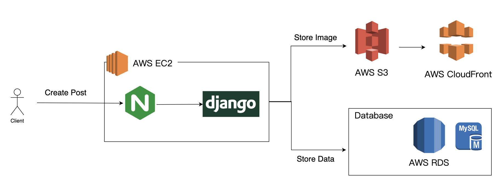
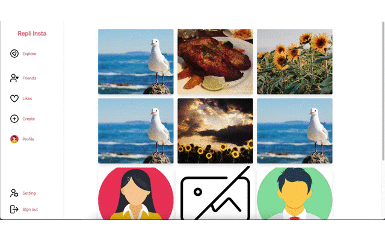
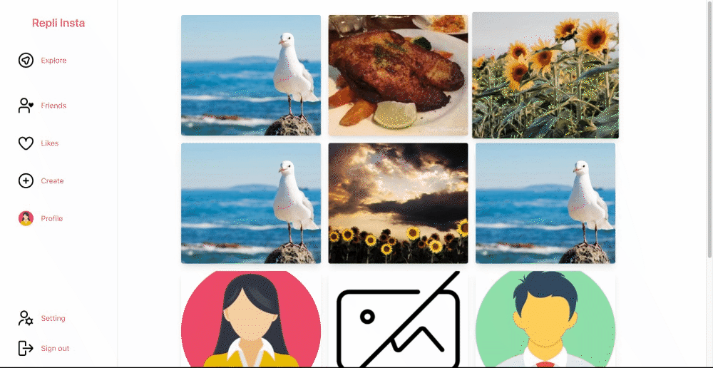

# Repli-Insta

## Introduction

"Repli Insta" is a social website that provides posting, commenting, and likes.

Website: https://planabcd.site/

## Technique

### Frontend

-   HTML
-   TailwindCSS
-   JavaScript

### Backend

-   Django
-   AWS RDS MySQL
-   AWS S3
-   AWS CloudFront
-   Nginx

## Structure

### Data Flow Diagram

### ER diagram

## API Endpoints

The project exposes the following RESTful API endpoints:

### Profile Management

-   **Get Profile Info:** `GET /profiles/profile/?slug={user_slug}`
-   **Create Profile:** `POST /profiles/profile/`
-   **Update Profile Info:** `PATCH /profiles/profile/?id={user_id}`

### Post Management

-   **Get All Posts:** `GET /posts/posts-list`
-   **Get Post by ID:** `GET /posts/post/?id={post_id}`
-   **Create Post:** `POST /posts/post`
-   **Update Post:** `PATCH /posts/post/?id={post_id}`
-   **Delete Post:** `DELETE /posts/post/?id={post_id}`

### Comment Management

-   **Get Comments for the post:** `GET /posts/comment/?id={post_id}`
-   **Create the Comment for the post:** `POST /posts/comment/?id={post_id}`

### Like Management

-   **Create Like or Unlike:** `POST /posts/like/?id={post_id}`

### Friends Management

-   **Get All Friends:** `GET /profiles/friends/`
-   **Add Friend:** `POST /profiles/friends/`
-   **Respond to Friend Request - accept or reject:** `PUT /profiles/friends/`
-   **Remove Friend:** `DELETE /profiles/friends/?friendId={friend_id}`

## Usage

### Explore all posts

### Leave comments and like posts

### Publish posts

### Browse friend profiles, liked posts, and other related pages

